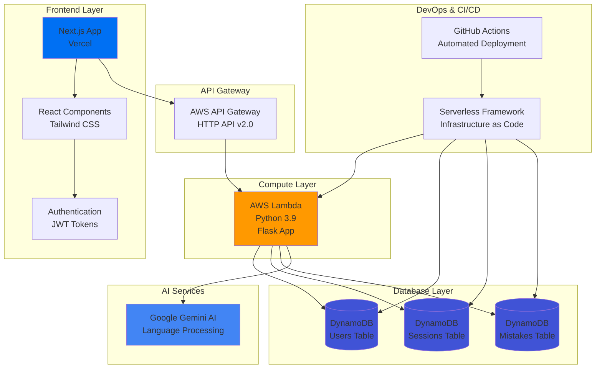

# 🤖 AI Language Helper - Serverless Edition

> **A production-ready, serverless AI-powered language learning platform built with modern cloud technologies**
[](https://nextjs.org/)
[](https://vercel.com/)
[](https://python.org/)
[](https://www.typescriptlang.org/)

## 🚀 Overview

AI Language Helper is a **serverless, scalable language learning platform** that leverages Google's Gemini AI to provide real-time conversation practice, instant corrections, and personalized feedback. Built with enterprise-grade AWS services and modern web technologies.

### ✨ Key Features

- 🤖 **AI-Powered Conversations** - Interactive chat with Google Gemini AI
- 🔄 **Real-time Corrections** - Instant grammar and vocabulary feedback
- 📊 **Personalized Analytics** - Track learning progress and mistakes
- 🌐 **Multi-language Support** - Practice any language at any level
- ⚡ **Serverless Architecture** - Auto-scaling, cost-effective infrastructure
- 🔐 **Secure Authentication** - JWT-based user management
- 📱 **Responsive Design** - Modern UI with Tailwind CSS

## 🏗️ Architecture



## 🛠️ Tech Stack

### **Frontend**
- **Framework**: Next.js 14 with App Router
- **Language**: TypeScript
- **Styling**: Tailwind CSS
- **UI Components**: Radix UI, Lucide Icons
- **State Management**: React Hooks
- **Deployment**: Vercel

### **Backend**
- **Runtime**: AWS Lambda (Python 3.9)
- **Framework**: Flask with WSGI
- **API Gateway**: AWS HTTP API v2.0
- **Authentication**: JWT with PyJWT
- **CORS**: Flask-CORS

### **Database**
- **Primary DB**: Amazon DynamoDB
- **Tables**: Users, Sessions, Mistakes
- **Indexing**: Global Secondary Indexes
- **Billing**: Pay-per-request

### **AI & External Services**
- **AI Model**: Google Gemini 1.5 Flash
- **Language Processing**: Real-time conversation analysis
- **Error Detection**: Grammar and vocabulary corrections

### **DevOps & Infrastructure**
- **IaC**: Serverless Framework
- **CI/CD**: GitHub Actions
- **Monitoring**: AWS CloudWatch
- **Version Control**: Git/GitHub

## 📁 Project Structure

```
AI-language-helper/
├── 📁 Backend/                    # Serverless Python backend
│   ├── 🐍 app.py                  # Main Flask application
│   ├── ⚡ lambda_handler.py       # AWS Lambda handler
│   ├── 🗄️ db_utils.py            # DynamoDB utilities
│   ├── 🤖 chatbot.py             # AI chat logic
│   ├── ⚙️ serverless.yml         # Infrastructure as Code
│   ├── 📦 requirements.txt       # Python dependencies
│   └── 🔐 .env.example          # Environment template
├── 📁 language-learning-frontend/ # Next.js frontend
│   ├── 📁 src/                   # React/Next.js source
│   ├── 📦 package.json          # JS dependencies
│   ├── ⚙️ next.config.js        # Next.js config
│   └── 🔐 .env.example         # Frontend env template
├── 📁 .github/workflows/        # CI/CD pipelines
│   └── 🚀 deploy-backend.yml    # Backend deployment
├── 🧪 test_backend.sh           # API testing script
├── 🚀 deploy.sh                 # Local deployment
└── 📖 README.md                 # This file
```

## 🚀 Quick Start

### Prerequisites
- Node.js 18+
- Python 3.9+
- AWS CLI configured
- Serverless Framework
- Gemini API Key

### 1. Clone & Setup
```bash
git clone https://github.com/yourusername/AI-language-Helper.git
cd AI-language-helper
```

### 2. Backend Deployment
```bash
cd Backend
npm install serverless-python-requirements
export SECRET_KEY="your-secret-key"
export GEMINI_API_KEY="your-gemini-api-key"
serverless deploy --stage prod
```

### 3. Frontend Deployment
```bash
cd language-learning-frontend
npm install
# Deploy to Vercel via dashboard
# Set NEXT_PUBLIC_API_URL to your API Gateway URL
```

### 4. Test Everything
```bash
./test_backend.sh
```

## 🔧 Configuration

### Environment Variables

**Backend (.env)**
```bash
SECRET_KEY=your-jwt-secret-key-here
GEMINI_API_KEY=your-gemini-api-key-here
AWS_REGION=us-east-1
```

**Frontend (.env.local)**
```bash
NEXT_PUBLIC_API_URL=https://your-api-gateway-url.amazonaws.com
```

### GitHub Secrets (CI/CD)
```
AWS_ACCESS_KEY_ID=your-aws-access-key
AWS_SECRET_ACCESS_KEY=your-aws-secret-key
SECRET_KEY=your-jwt-secret
GEMINI_API_KEY=your-gemini-key
```

## 📊 API Endpoints

| Method | Endpoint | Description | Auth Required |
|--------|----------|-------------|---------------|
| `GET` | `/health` | Health check | ❌ |
| `POST` | `/register` | User registration | ❌ |
| `POST` | `/login` | User authentication | ❌ |
| `GET` | `/logout` | User logout | ❌ |
| `GET` | `/api/verify_session` | Token validation | ✅ |
| `POST` | `/api/start_session` | Start learning session | ✅ |
| `POST` | `/api/chat` | Send chat message | ✅ |
| `GET` | `/api/feedback` | Get learning feedback | ✅ |

## 🏗️ AWS Infrastructure

### Resources Created
- **Lambda Function**: `ai-language-helper-backend-prod-api`
- **API Gateway**: HTTP API v2.0 with CORS
- **DynamoDB Tables**:
  - `ai-language-helper-backend-users-prod`
  - `ai-language-helper-backend-sessions-prod`
  - `ai-language-helper-backend-mistakes-prod`
- **IAM Roles**: Lambda execution with DynamoDB permissions

### Cost Optimization
- **Pay-per-request** DynamoDB billing
- **Lambda** charges only for execution time
- **API Gateway** charges per request
- **No idle costs** - truly serverless

## 🔒 Security Features

- 🔐 **JWT Authentication** with secure token validation
- 🔒 **Password Hashing** using Werkzeug security
- 🌐 **CORS Configuration** for secure cross-origin requests
- 🔑 **Environment Variables** for sensitive data
- 🛡️ **AWS IAM** role-based access control
- 🚫 **Input Validation** on all endpoints

## 📈 Performance & Scalability

- ⚡ **Auto-scaling** Lambda functions
- 🚀 **Global CDN** via Vercel
- 📊 **DynamoDB** single-digit millisecond latency
- 🔄 **Stateless architecture** for horizontal scaling
- 💾 **Efficient caching** strategies

## 🧪 Testing

Run comprehensive API tests:
```bash
./test_backend.sh
```

Tests cover:
- Health checks
- User registration/login
- Token validation
- Session management
- AI chat functionality
- Feedback system

## 🚀 Deployment

### Automated (Recommended)
Push to `main` branch triggers GitHub Actions deployment

### Manual
```bash
./deploy.sh
```

## 🤝 Contributing

1. Fork the repository
2. Create feature branch (`git checkout -b feature/amazing-feature`)
3. Commit changes (`git commit -m 'Add amazing feature'`)
4. Push to branch (`git push origin feature/amazing-feature`)
5. Open Pull Request

## 🆘 Troubleshooting

### Common Issues

**Lambda Cold Starts**
- First request may be slower (~2-3s)
- Subsequent requests are fast (~100-200ms)

**DynamoDB Throttling**
- Increase read/write capacity if needed
- Monitor CloudWatch metrics

**CORS Errors**
- Ensure API Gateway CORS is configured
- Check frontend API URL configuration

### Support

- 📧 **Email**: [akashkallai27@gmail.com]
- 🐛 **Issues**: [GitHub Issues](https://github.com/yourusername/AI-language-Helper/issues)
- 💬 **Discussions**: [GitHub Discussions](https://github.com/akash2704/AI-language-Helper/discussions)

---

<div align="center">

**Built with ❤️ by [Akash Ajay Kallai](https://github.com/akash2704)**

*Showcasing modern serverless architecture, AI integration, and full-stack development skills*

[](https://www.linkedin.com/in/akash-kallai-979a081ba/)
[](https://github.com/akash2704)
[](https://akashkallai.vercel.app/)

</div>
